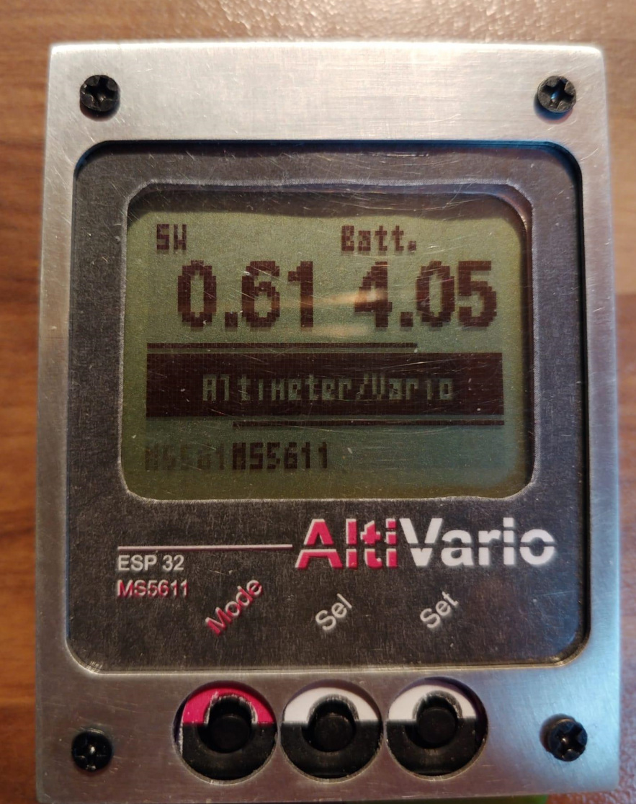
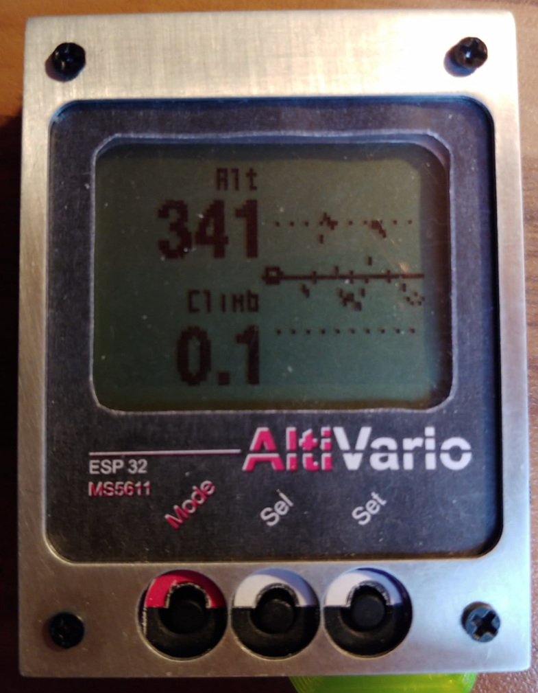
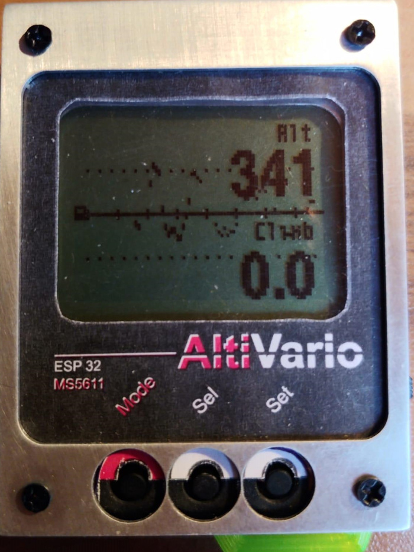
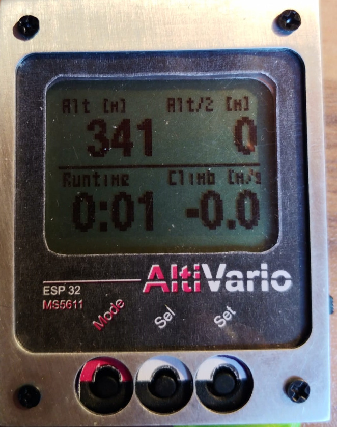
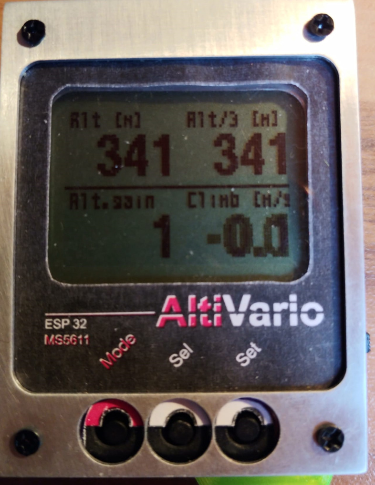
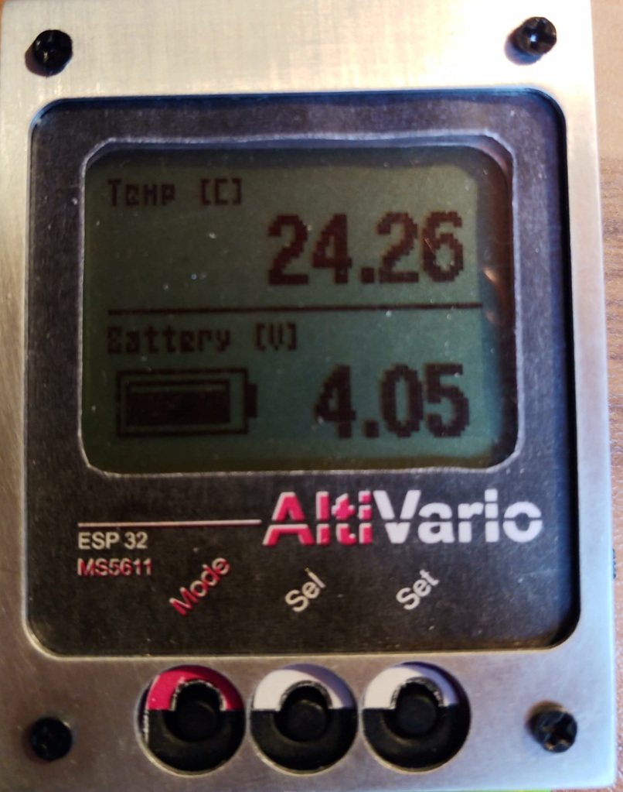
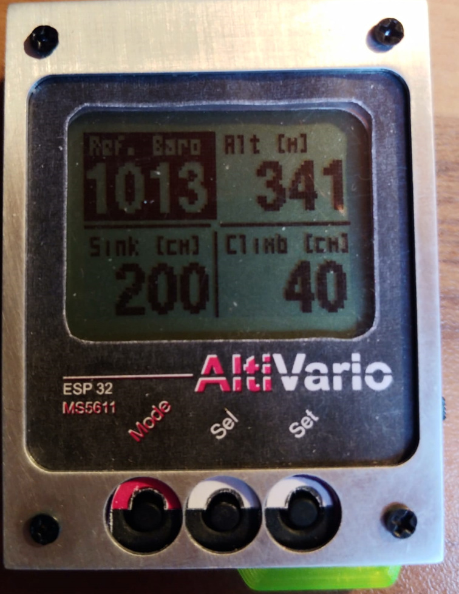
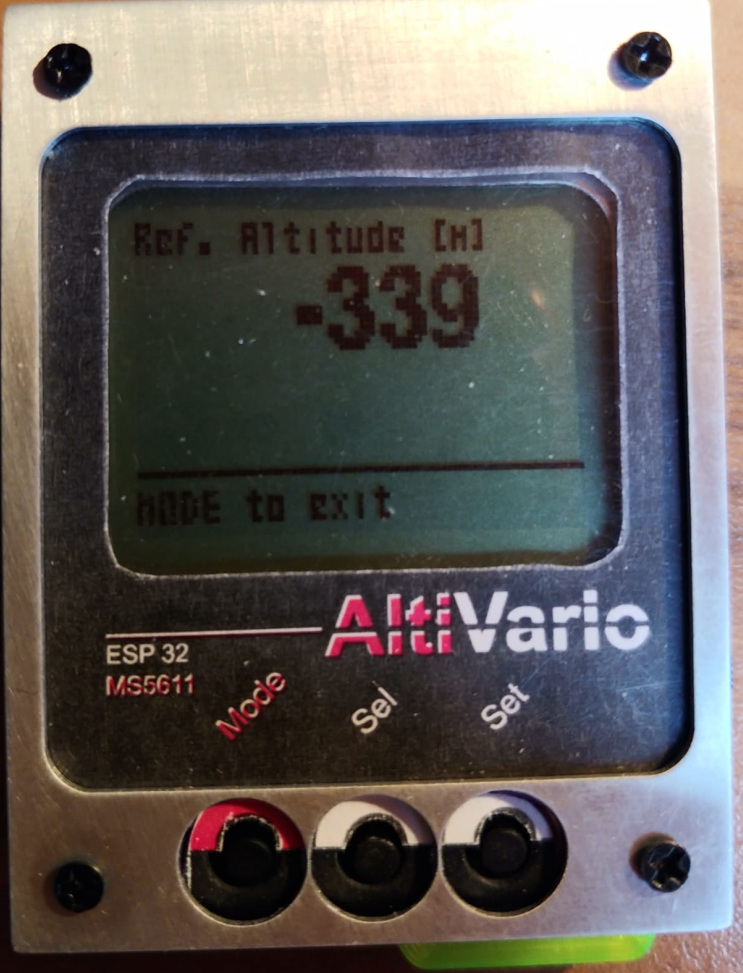
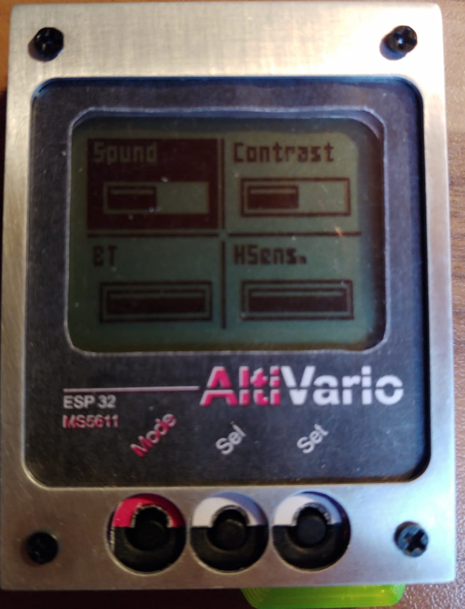
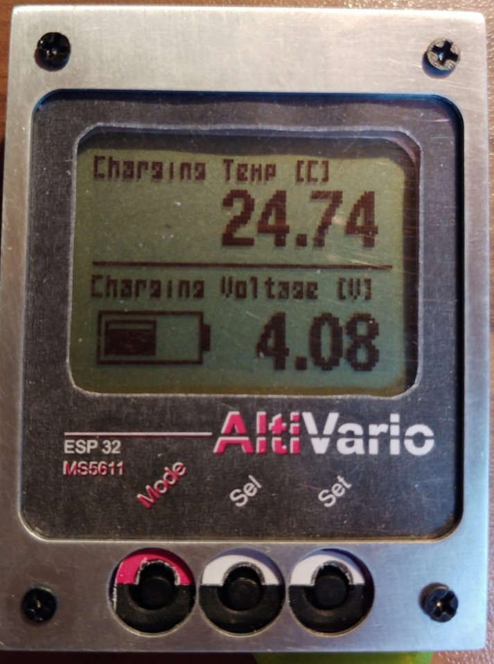

# AltiVario – návod k použití

*Pavel, 12. 10. 2021 · Původní dokumentace k verzi softwaru 0.61.*

Stručný návod k ovládání přístroje AltiVario, jeho nastavení, propojení s XCTrack a nabíjení.

> **Poznámka:** Popis odpovídá původní verzi 0.61 z roku 2021. Údaje o výdrži a dostupných funkcích se vztahují k této verzi.

## 1. Úvodní obrazovka a tlačítka

Úvodní obrazovka zobrazuje verzi softwaru a napětí LiPo článku. Na přístroji jsou tři tlačítka: **MODE**, **SEL** a **SET**.

## 2. Provozní obrazovky

Jednotlivé provozní obrazovky se přepínají **krátkým stiskem MODE**.

### Obrazovka 1 – Výška, vário a graf (varianta 1)

### Obrazovka 2 – Výška, vário a graf (varianta 2)

### Obrazovka 3 – Alt, Alt2, čas a vário

Stisk **SET** na této obrazovce resetuje hodnotu **Alt2**. Typicky se používá k vynulování výšky na zemi.

### Obrazovka 4 – Alt, Alt3, výškový zisk a vário

Stisk **SET** na této obrazovce resetuje hodnotu **Alt3**. Typicky se používá při vlétnutí do stoupavého proudu.

### Obrazovka 5 – Teplota a baterie

Dlouhým stiskem **SET** na této obrazovce se přístroj přepne do nabíjecího režimu. Změní se kalibrace měření napětí a vypne se zvuková signalizace. Zpět do běžného režimu se lze vrátit pouze vypnutím a opětovným zapnutím přístroje.

## 3. Nastavení

Do nastavení se vstupuje **dlouhým stiskem MODE**. Obsahuje dvě obrazovky, mezi nimiž se přepíná krátkým stiskem **MODE**. Dlouhý stisk **MODE** vrátí přístroj do hlavního režimu.

### 3.1 Referenční výška / tlak a hranice signalizace

Na první obrazovce lze nastavit referenční tlak v hPa nebo referenční výšku v metrech a prahové hodnoty zvukové signalizace stoupání a klesání (**lift/sink**).

- **SEL** přepíná mezi nastavovanými položkami.
- **SET** zahajuje úpravu vybrané položky.
- Hodnoty se upravují po jednotlivých číslicích pomocí **SEL/SET**.

Příklad zobrazení při úpravě referenční výšky:

### 3.2 Zvuk, kontrast, Bluetooth a citlivost

Na druhé obrazovce jsou nastavení zobrazená jako posuvné pruhy. Pomocí **SEL** se vybere položka, pomocí **SET** se změní její hodnota.

| Položka | Význam |
| --- | --- |
| **Sound** | Tři režimy: `OFF`, `NORMAL`, `LIVELY AIR`. Poslední režim indikuje drobné pohyby vzduchu kolem nulového stoupání („poklepávání“). |
| **Contrast** | U použitého CZ displeje podle původního návodu nefunguje / není potřeba. |
| **BT** | Položka Bluetooth na obrazovce nastavení; původní text její ovládání blíže nepopisuje. |
| **HSens.** | Příprava na regulaci citlivosti; ve verzi 0.61 ještě není funkční. |

## 4. Propojení s XCTrack

1. V Bluetooth vyhledejte zařízení **BT AltiVario** a spárujte je bez zadání kódu.
2. V aplikaci **XCTrack** otevřete **Connection & Sensors** a vyberte **BT AltiVario**.
3. Zapněte volbu **Use external barometer**.
4. Položka **Calibrate** zobrazí hodnoty měřené variometrem.

V původním návodu je jako příklad uvedeno měření **330,835 ± 0,096 m**; autor tuto hodnotu srovnává s deklarovanou přesností použitého senzoru **MS5611** (přibližně 10 cm).

Doporučuje se přidat na hlavní obrazovku XCTrack údaj **Baro Alt** a před vzletem zkalibrovat tlak podle výšky místa startu.

## 5. Nabíjení

Původní konstrukce nemá automatickou správu nabíjení (*power management*). Nabíjení probíhá přes USB a vyžaduje **sledování napětí baterie**. Autor původního návodu doporučuje slabší napájecí zdroj.

1. Zapněte přístroj.
2. Pomocí **MODE** přejděte na obrazovku s baterií (obrazovka 5).
3. Podržte **SET**, dokud se nezobrazí nabíjecí režim.

V nabíjecím režimu odpovídá zobrazené napětí lépe skutečnému napětí článku a vário nevydává zvukové signály. Návrat do běžného režimu vyžaduje vypnutí a zapnutí přístroje.

> **Upozornění:** Nabíjecí režim nenahrazuje ochranu LiPo článku ani automatické ukončení nabíjení. Původní dokument výslovně uvádí, že přístroj nemá power management; nabíjení proto vyžaduje odpovídající bezpečné zapojení a dohled.

## 6. Hardware a výdrž

- **Displej:** Nokia
- **Barometrický senzor:** MS5611
- **Procesor:** ESP32 se sníženou frekvencí jádra kvůli spotřebě
- **Odhadovaná výdrž podle původního návodu:** přibližně 6 hodin s Bluetooth, déle bez Bluetooth; u větší baterie autor očekával přibližně 8 hodin.

Firmware verze **0.61** byl podle původního dokumentu dostupný ve zdrojových kódech a bylo jej možné aktualizovat přes USB. Původní Word obsahuje vložený objekt/ikonu ZIP archivu, nikoli ověřený odkaz na repozitář; odkaz na aktuální firmware je potřeba doplnit samostatně.
